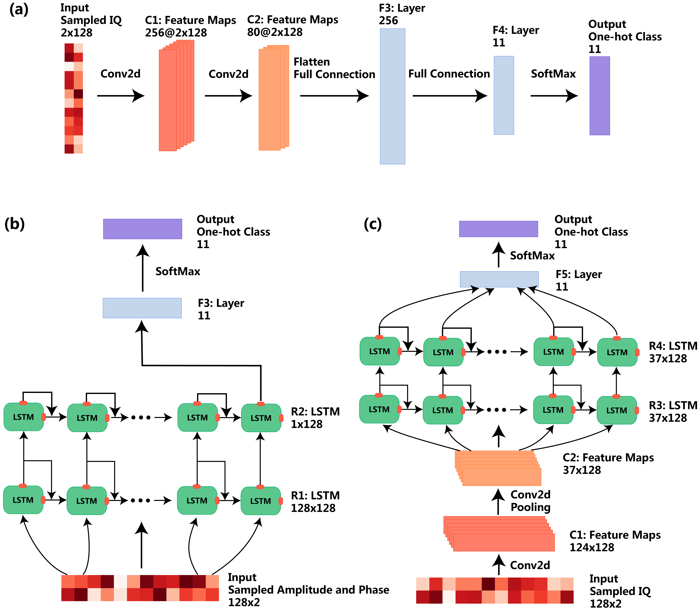

# Sequential Convolutional Recurrent Neural Networks for fast automatic modulation classification

Machine Learning for Wireless communications course project on Sequential Convolutional Recurrent Neural Networks for fast automatic modulation classification by Kaisheng Liao; Yaodong Zhao; Jie Gu; Yaping Zhang; Yi Zhong.

Link to the paper: https://ieeexplore.ieee.org/document/9330604 The datasets for this project can be found at https://www.deepsig.io/datasets.

## Citation

> @article{liao2021sequential,
> title={Sequential convolutional recurrent neural networks for fast automatic modulation classification},
> author={Liao, Kaisheng and Zhao, Yaodong and Gu, Jie and Zhang, Yaping and Zhong, Yi},
> journal={IEEE Access},
> volume={9},
> pages={27182--27188},
> year={2021},
> publisher={IEEE}
> }
